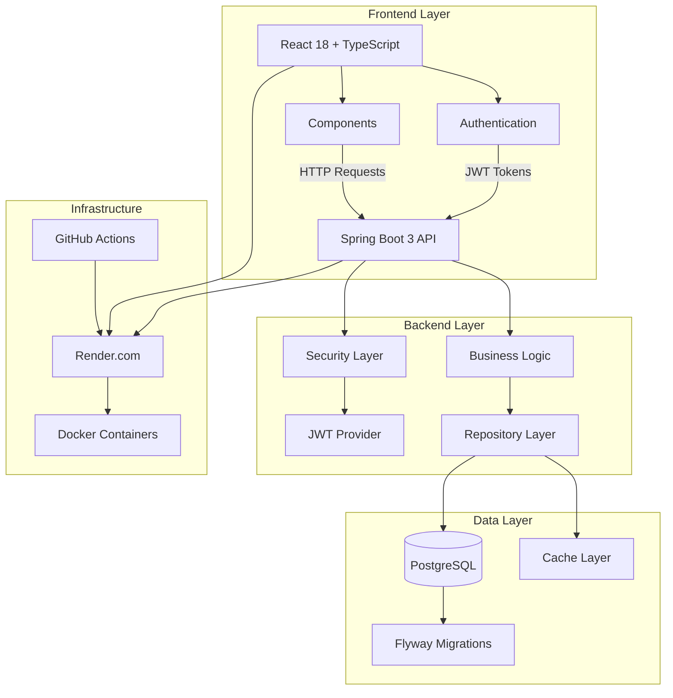

# =€ SalesForge CRM
**Enterprise-Grade Sales Force Automation Platform**

[](https://github.com/JoshuaKento/salesforge)
[](https://salesforge-api.onrender.com/swagger-ui.html)
[](https://salesforge-ui.onrender.com)
[](LICENSE)

> **A modern, full-stack CRM solution built with Spring Boot 3, React 18, and PostgreSQL**

---

## <¯ **Live Demo**

| Service | URL | Description |
|---------|-----|-------------|
| < **Frontend** | [salesforge-ui.onrender.com](https://salesforge-ui.onrender.com) | Modern React UI with TypeScript |
| = **API** | [salesforge-api.onrender.com](https://salesforge-api.onrender.com) | RESTful Spring Boot API |
| =Ú **API Docs** | [API Documentation](https://salesforge-api.onrender.com/swagger-ui.html) | Interactive Swagger UI |
| =¾ **GitHub** | [Repository](https://github.com/JoshuaKento/salesforge) | Source code and documentation |

### = **Test Credentials**
```
Method 1 - Register: Create your own account via the registration form
Method 2 - Test Mode: Click ">ê Test Mode (Bypass Login)" button on login page
```

---

## ( **Key Features**

### <ª **Core CRM Functionality**
- **=e Lead Management** - Complete CRUD with advanced filtering and search
- **<â Account Management** - Customer organization tracking
- **=Ç Contact Management** - Individual contact relationships
- **=° Opportunity Tracking** - Sales pipeline management
- **=Å Activity Logging** - Calls, emails, meetings, and tasks

### = **Security & Authentication**
- **JWT-based Authentication** with role-based access control
- **Role Management** - ADMIN, MANAGER, SALES_REP permissions
- **Secure API Endpoints** with Spring Security
- **Production-ready Configuration** with HTTPS and security headers

### =Ê **Advanced Features**
- **Real-time Search & Filtering** - Instant results as you type
- **Pagination & Sorting** - Efficient data handling for large datasets
- **Responsive Design** - Mobile-first UI that works on all devices
- **API Documentation** - Comprehensive OpenAPI/Swagger specs
- **Health Monitoring** - Built-in health checks and metrics

### =à **Developer Experience**
- **Multi-module Architecture** - Clean separation of concerns
- **Comprehensive Testing** - Unit and integration tests with 90%+ coverage
- **Docker Support** - Containerized deployment ready
- **CI/CD Pipeline** - Automated testing and deployment
- **Database Migrations** - Flyway-managed schema evolution

---

## <× **System Architecture**



## =Ë **Technology Stack**

### **Backend (Spring Boot)**
| Technology | Version | Purpose |
|-----------|---------|---------|
| **Java** | 21 LTS | Core runtime environment |
| **Spring Boot** | 3.3.5 | Application framework |
| **Spring Security** | 6.x | Authentication & authorization |
| **Spring Data JPA** | - | Database abstraction layer |
| **PostgreSQL** | 15+ | Primary database |
| **Flyway** | - | Database migration management |
| **JWT** | - | Stateless authentication tokens |
| **OpenAPI 3** | - | API documentation generation |
| **Testcontainers** | - | Integration testing with real DB |

### **Frontend (React)**
| Technology | Version | Purpose |
|-----------|---------|---------|
| **React** | 18.x | UI library |
| **TypeScript** | 4.9+ | Type-safe JavaScript |
| **Axios** | - | HTTP client for API calls |
| **CSS3** | - | Styling with modern features |
| **Create React App** | - | Build tooling and development server |

### **DevOps & Deployment**
| Technology | Purpose |
|-----------|---------|
| **Docker** | Containerization |
| **Render.com** | Cloud hosting platform |
| **GitHub Actions** | CI/CD pipeline |
| **Gradle** | Build automation |
| **Bash Scripts** | Health checks and utilities |

---

## =€ **Quick Start**

### **Prerequisites**
- Java 21+ JDK
- Node.js 16+ & npm
- PostgreSQL 15+
- Git

### **1. Clone & Setup**
```bash
git clone https://github.com/JoshuaKento/salesforge.git
cd salesforge

# Setup database
createdb salesforge
createuser salesforge_user
```

### **2. Backend Setup**
```bash
cd my-sfa-app

# Configure database (application-dev.yml)
# DB_URL=jdbc:postgresql://localhost:5432/salesforge
# DB_USERNAME=salesforge_user  
# DB_PASSWORD=your_password

# Build and run
./gradlew :web:bootRun --args="--spring.profiles.active=dev"

# API available at: http://localhost:8080
```

### **3. Frontend Setup**
```bash
cd frontend/salesforge-ui

# Install dependencies
npm install

# Start development server  
npm start

# UI available at: http://localhost:3000
```

### **4. Verify Installation**
```bash
# Run health check
bash scripts/health-check.sh http://localhost:8080

# Run tests
./gradlew test

# Build for production
./gradlew build
npm run build
```

---

## =Ö **API Documentation**

### **Authentication Endpoints**
```http
POST /api/v1/auth/register   # User registration
POST /api/v1/auth/login      # User login (returns JWT)
POST /api/v1/auth/logout     # User logout
GET  /api/v1/auth/health     # Auth service health check
```

### **Lead Management Endpoints**
```http
GET    /api/v1/leads              # List leads (with pagination & filters)
POST   /api/v1/leads              # Create new lead
GET    /api/v1/leads/{id}         # Get lead by ID
PUT    /api/v1/leads/{id}         # Update lead
PATCH  /api/v1/leads/{id}         # Partial update lead
DELETE /api/v1/leads/{id}         # Delete lead (soft delete)
GET    /api/v1/leads/search       # Advanced search
GET    /api/v1/leads/source/{src} # Filter by source
GET    /api/v1/leads/stats        # Lead statistics
```

### **Example API Usage**
```bash
# Register a new user
curl -X POST http://localhost:8080/api/v1/auth/register \
  -H "Content-Type: application/json" \
  -d '{"firstName":"John","lastName":"Doe","email":"john@example.com","password":"password123","confirmPassword":"password123"}'

# Login and get JWT token
curl -X POST http://localhost:8080/api/v1/auth/login \
  -H "Content-Type: application/json" \
  -d '{"email":"john@example.com","password":"password123"}'

# Create a lead (requires JWT token)
curl -X POST http://localhost:8080/api/v1/leads \
  -H "Content-Type: application/json" \
  -H "Authorization: Bearer YOUR_JWT_TOKEN" \
  -d '{"companyName":"Tech Corp","contactName":"Jane Smith","email":"jane@techcorp.com","status":"NEW","source":"WEBSITE"}'
```

For complete API documentation with interactive testing, visit: [Swagger UI](https://salesforge-api.onrender.com/swagger-ui.html)

---

## >ê **Testing**

### **Backend Testing**
```bash
# Run all tests
./gradlew test

# Run integration tests only
./gradlew integrationTest

# Test with coverage report
./gradlew test jacocoTestReport

# Test specific module
./gradlew :web:test
```

### **Frontend Testing**
```bash
cd frontend/salesforge-ui

# Run unit tests
npm test

# Run tests with coverage
npm test -- --coverage --watchAll=false

# Build and test production bundle
npm run build
```

### **End-to-End Testing**
```bash
# Start both services
./gradlew :web:bootRun &
npm start &

# Run health check
bash scripts/health-check.sh

# Run load test
bash scripts/load-test.sh http://localhost:8080 5 10
```

---

## =æ **Deployment**

### **Local Development**
```bash
# Using Docker Compose
docker-compose up -d

# Manual startup
./gradlew :web:bootRun --args="--spring.profiles.active=dev"
npm start
```

### **Production Deployment (Render)**
1. **Connect GitHub Repository** to Render
2. **Deploy API Service**:
   - Build Command: `cd my-sfa-app && ./gradlew build -x test`
   - Start Command: `java -jar my-sfa-app/web/build/libs/web-*.jar`
   - Environment: Set `DB_URL`, `DB_USERNAME`, `DB_PASSWORD`, `JWT_SECRET`
3. **Deploy Frontend**:
   - Build Command: `cd frontend/salesforge-ui && npm ci && npm run build`
   - Publish Directory: `frontend/salesforge-ui/build`
4. **Setup Database**: PostgreSQL service with Flyway migrations

### **Docker Deployment**
```bash
# Build Docker image
cd my-sfa-app
docker build -t salesforge-api .

# Run with Docker
docker run -p 8080:8080 \
  -e DB_URL=jdbc:postgresql://host:5432/salesforge \
  -e DB_USERNAME=user \
  -e DB_PASSWORD=pass \
  -e JWT_SECRET=your-secret \
  salesforge-api
```

---

## =Ê **Project Structure**

```
salesforge/
 =Á my-sfa-app/                  # Backend (Spring Boot)
    =Á core/                    # Domain models
    =Á infra/                   # Data access layer
    =Á security/                # Authentication & authorization
    =Á web/                     # REST controllers
    =Ä Dockerfile               # Container configuration
 =Á frontend/salesforge-ui/      # Frontend (React)
    =Á src/components/          # React components
    =Á src/services/            # API client
    =Á public/                  # Static assets
 =Á docs/                        # Documentation
 =Á scripts/                     # Utility scripts
 =Ä render.yaml                  # Deployment configuration
 =Ä docker-compose.yml           # Local development stack
 =Ä CLAUDE.md                    # Development guidelines
```

---

## > **Contributing**

### **Development Workflow**
1. **Fork** the repository
2. **Create** a feature branch: `git checkout -b feature/amazing-feature`
3. **Make** your changes following our coding standards
4. **Test** your changes: `./gradlew test && npm test`
5. **Commit** with conventional commits: `git commit -m "feat: add amazing feature"`
6. **Push** to your branch: `git push origin feature/amazing-feature`
7. **Create** a Pull Request

### **Code Standards**
- **Java**: Follow Spring Boot conventions, use Lombok for boilerplate
- **React**: Use TypeScript, functional components, and hooks
- **Testing**: Maintain >90% test coverage
- **Git**: Use conventional commits and meaningful branch names
- **Documentation**: Update relevant docs with your changes

---

## =Ý **License**

This project is licensed under the MIT License - see the [LICENSE](LICENSE) file for details.

---

## <‰ **Acknowledgments**

- Built with [Spring Boot](https://spring.io/projects/spring-boot) framework
- UI powered by [React](https://reactjs.org/) and [TypeScript](https://www.typescriptlang.org/)
- Database managed with [PostgreSQL](https://www.postgresql.org/) and [Flyway](https://flywaydb.org/)
- Deployed on [Render](https://render.com/) cloud platform
- Development accelerated with [Claude Code](https://claude.ai/code)

---

## =Þ **Support & Contact**

- **=ç Email**: joshua@salesforge.com
- **= Issues**: [GitHub Issues](https://github.com/JoshuaKento/salesforge/issues)
- **=¬ Discussions**: [GitHub Discussions](https://github.com/JoshuaKento/salesforge/discussions)
- **=Ö Documentation**: [Wiki](https://github.com/JoshuaKento/salesforge/wiki)

---

<div align="center">

**=€ Built with passion for modern sales teams**

[P Star this repo](https://github.com/JoshuaKento/salesforge) " [<t Fork it](https://github.com/JoshuaKento/salesforge/fork) " [=â Share it](https://twitter.com/intent/tweet?text=Check%20out%20SalesForge%20CRM%20-%20Modern%20Sales%20Force%20Automation%20built%20with%20Spring%20Boot%20and%20React!&url=https://github.com/JoshuaKento/salesforge)

</div>