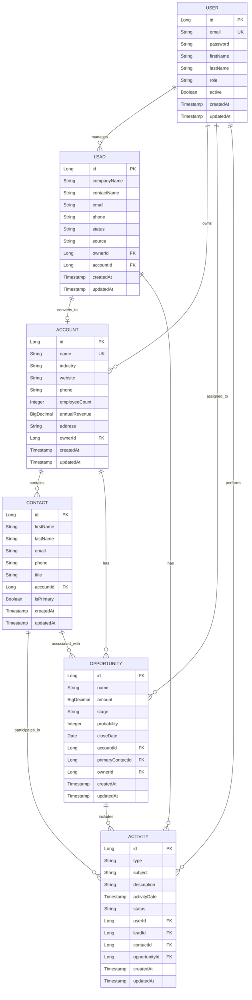
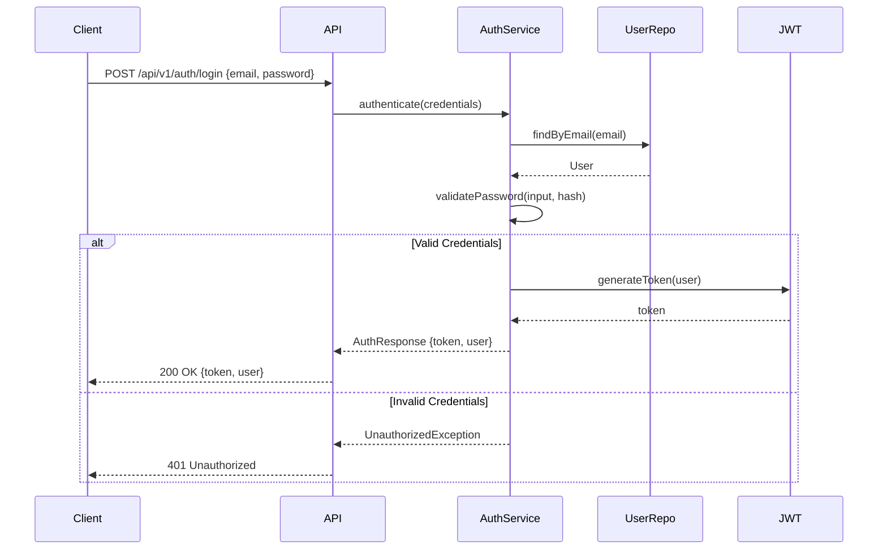
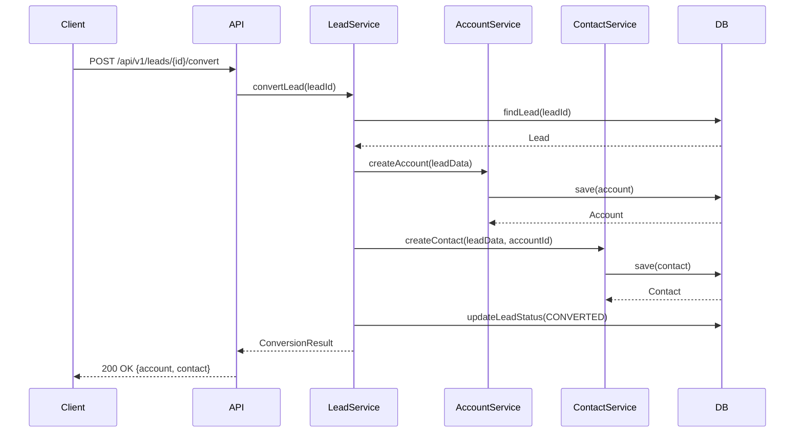
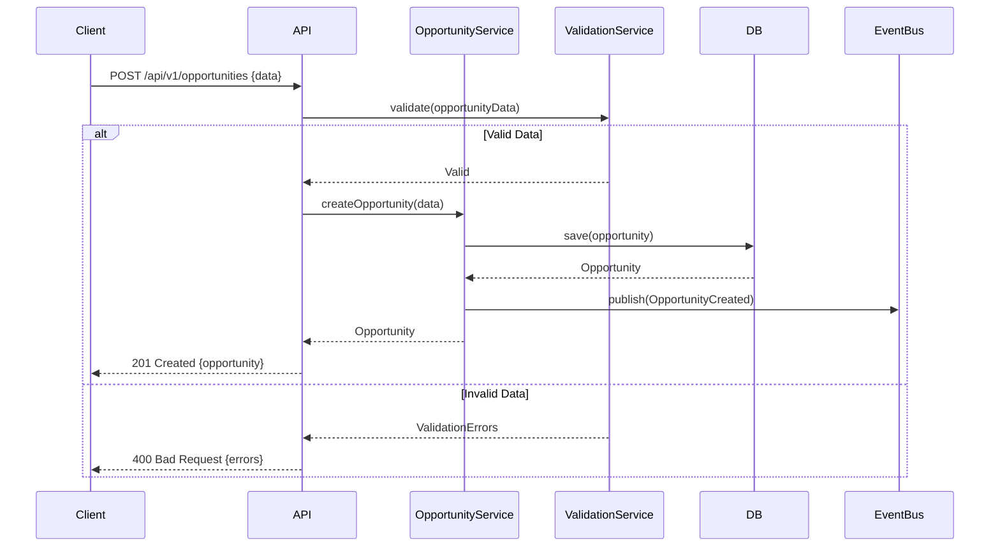

# SalesForge - Sales Force Automation Mini-App Specification

## 1. Domain Model

### Core Entities

#### User
- Represents system users (sales reps, managers, admins)
- Authentication and authorization

#### Lead
- Potential customers not yet qualified
- Tracks initial contact and interest level

#### Account
- Qualified organizations/companies
- Customer profile and business information

#### Contact
- Individual people within accounts
- Primary communication points

#### Opportunity
- Potential deals/sales
- Pipeline tracking and revenue forecasting

#### Activity
- Interactions with leads/contacts (calls, emails, meetings)
- Activity history and follow-ups

### Entity Relationships



## 2. REST API Endpoints

### Authentication
```
POST   /api/v1/auth/login         # Login with credentials
POST   /api/v1/auth/logout        # Logout current session
POST   /api/v1/auth/refresh       # Refresh JWT token
GET    /api/v1/auth/me           # Get current user profile
```

### Users Management
```
GET    /api/v1/users             # List all users (admin only)
GET    /api/v1/users/{id}        # Get user by ID
POST   /api/v1/users             # Create new user (admin only)
PUT    /api/v1/users/{id}        # Update user
DELETE /api/v1/users/{id}        # Deactivate user (soft delete)
```

### Leads
```
GET    /api/v1/leads             # List leads (with filters)
GET    /api/v1/leads/{id}        # Get lead details
POST   /api/v1/leads             # Create new lead
PUT    /api/v1/leads/{id}        # Update lead
DELETE /api/v1/leads/{id}        # Delete lead
POST   /api/v1/leads/{id}/convert # Convert lead to account
GET    /api/v1/leads/{id}/activities # Get lead activities
```

### Accounts
```
GET    /api/v1/accounts          # List accounts
GET    /api/v1/accounts/{id}     # Get account details
POST   /api/v1/accounts          # Create new account
PUT    /api/v1/accounts/{id}     # Update account
DELETE /api/v1/accounts/{id}     # Delete account
GET    /api/v1/accounts/{id}/contacts # Get account contacts
GET    /api/v1/accounts/{id}/opportunities # Get account opportunities
```

### Contacts
```
GET    /api/v1/contacts          # List all contacts
GET    /api/v1/contacts/{id}     # Get contact details
POST   /api/v1/contacts          # Create new contact
PUT    /api/v1/contacts/{id}     # Update contact
DELETE /api/v1/contacts/{id}     # Delete contact
GET    /api/v1/contacts/{id}/activities # Get contact activities
```

### Opportunities
```
GET    /api/v1/opportunities     # List opportunities
GET    /api/v1/opportunities/{id} # Get opportunity details
POST   /api/v1/opportunities     # Create new opportunity
PUT    /api/v1/opportunities/{id} # Update opportunity
DELETE /api/v1/opportunities/{id} # Delete opportunity
GET    /api/v1/opportunities/{id}/activities # Get opportunity activities
POST   /api/v1/opportunities/{id}/stage # Update opportunity stage
```

### Activities
```
GET    /api/v1/activities        # List activities
GET    /api/v1/activities/{id}   # Get activity details
POST   /api/v1/activities        # Create new activity
PUT    /api/v1/activities/{id}   # Update activity
DELETE /api/v1/activities/{id}   # Delete activity
GET    /api/v1/activities/upcoming # Get upcoming activities
```

### Reports & Analytics
```
GET    /api/v1/reports/pipeline  # Sales pipeline report
GET    /api/v1/reports/forecast  # Revenue forecast
GET    /api/v1/reports/activities # Activity summary
GET    /api/v1/reports/conversion # Lead conversion rates
```

## 3. Sequence Diagrams

### User Authentication Flow



### Lead Conversion Flow



### Create Opportunity Flow



## 4. API Request/Response Examples

### Login Request
```json
POST /api/v1/auth/login
{
  "email": "john.doe@company.com",
  "password": "securePassword123"
}

Response: 200 OK
{
  "token": "eyJhbGciOiJIUzI1NiIsInR5cCI6IkpXVCJ9...",
  "user": {
    "id": 1,
    "email": "john.doe@company.com",
    "firstName": "John",
    "lastName": "Doe",
    "role": "SALES_REP"
  }
}
```

### Create Lead Request
```json
POST /api/v1/leads
Authorization: Bearer {token}
{
  "companyName": "Tech Innovations Inc",
  "contactName": "Jane Smith",
  "email": "jane.smith@techinnovations.com",
  "phone": "+1-555-0123",
  "status": "NEW",
  "source": "WEBSITE"
}

Response: 201 Created
{
  "id": 123,
  "companyName": "Tech Innovations Inc",
  "contactName": "Jane Smith",
  "email": "jane.smith@techinnovations.com",
  "phone": "+1-555-0123",
  "status": "NEW",
  "source": "WEBSITE",
  "ownerId": 1,
  "createdAt": "2024-07-29T10:30:00Z",
  "updatedAt": "2024-07-29T10:30:00Z"
}
```

### List Opportunities with Filters
```json
GET /api/v1/opportunities?stage=PROPOSAL&minAmount=50000&ownerId=1
Authorization: Bearer {token}

Response: 200 OK
{
  "content": [
    {
      "id": 456,
      "name": "Enterprise Software Deal",
      "amount": 75000.00,
      "stage": "PROPOSAL",
      "probability": 60,
      "closeDate": "2024-08-15",
      "account": {
        "id": 789,
        "name": "Global Corp"
      },
      "owner": {
        "id": 1,
        "name": "John Doe"
      }
    }
  ],
  "totalElements": 1,
  "totalPages": 1,
  "page": 0,
  "size": 20
}
```

## 5. Security Considerations

- JWT-based authentication with token expiration
- Role-based access control (ADMIN, MANAGER, SALES_REP)
- Data ownership validation (users can only modify their own records)
- Input validation and sanitization
- HTTPS only in production
- Rate limiting on API endpoints
- Audit logging for sensitive operations

## 6. Performance Considerations

- Pagination for all list endpoints
- Database indexing on frequently queried fields
- Lazy loading for related entities
- Caching strategy for reference data
- Async processing for heavy operations
- Connection pooling configuration